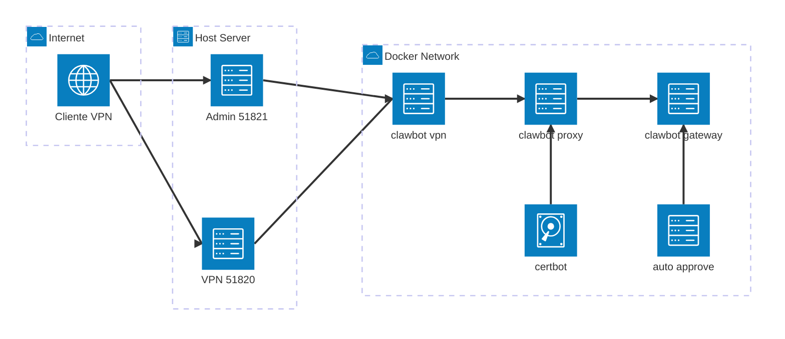
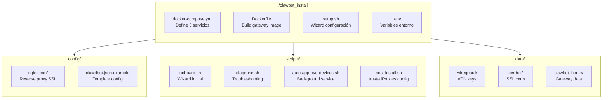
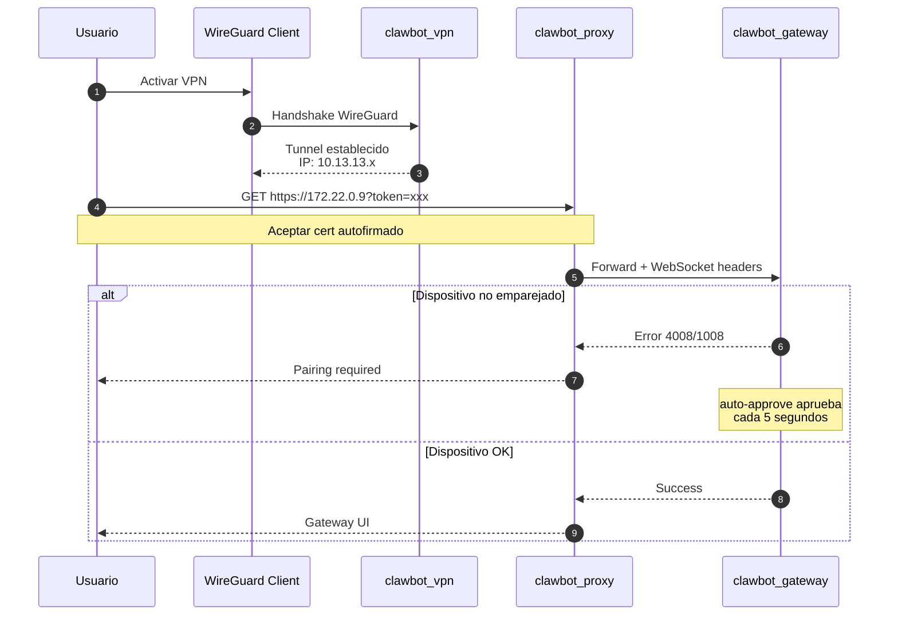
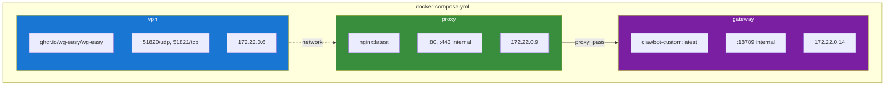
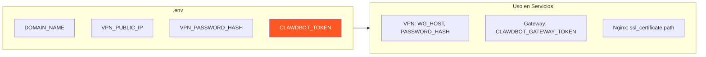
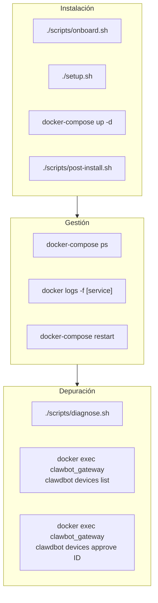
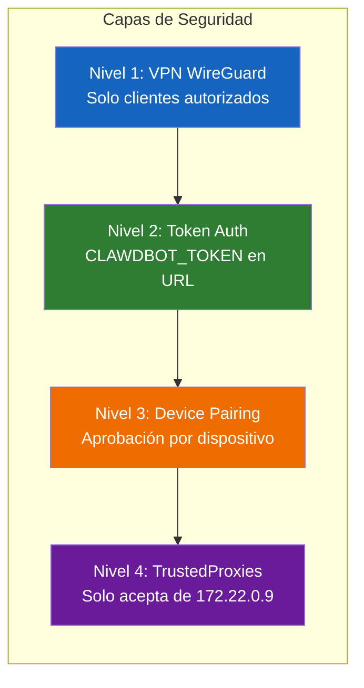
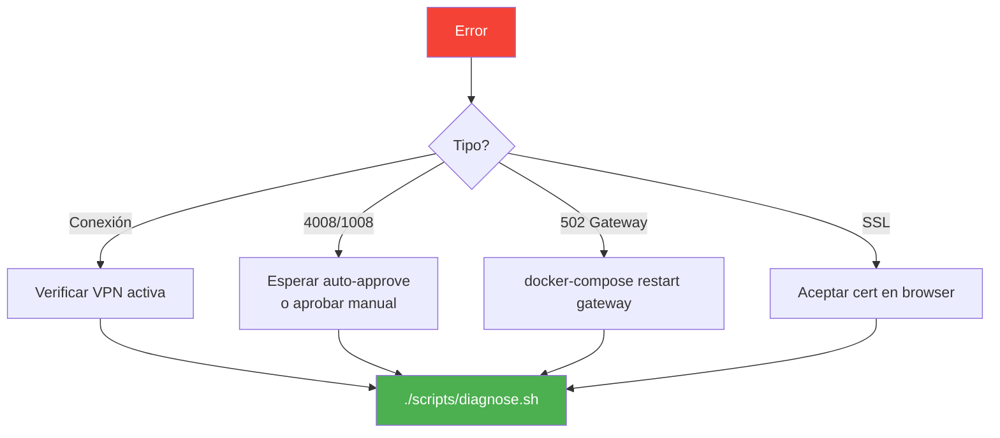

# Clawbot Secure Gateway - Instrucciones para Agentes AI

> 📖 Documentación oficial: https://docs.openclaw.ai/

## Arquitectura del Sistema

### IPs del Docker Network (172.22.0.0/24)
| Servicio | IP | Puerto |
|----------|----|----|
| vpn | 172.22.0.6 | 51820/udp, 51821/tcp |
| proxy | 172.22.0.9 | 80, 443 |
| gateway | 172.22.0.14 | 18789 |

## Flujo de Instalación

```mermaid
flowchart LR
    subgraph STEP1["Paso 1: Onboarding"]
        O1["./scripts/onboard.sh"]
        O2["Seleccionar proveedor IA"]
        O3["Login GitHub Device"]
        O4["Generar token"]
    end
    
    subgraph STEP2["Paso 2: Setup Server"]
        S1["./setup.sh"]
        S2["Configurar dominio/IP"]
        S3["Generar hash VPN"]
        S4["Crear certificados SSL"]
    end
    
    subgraph STEP3["Paso 3: Deploy"]
        D1["docker-compose up -d"]
        D2["./scripts/post-install.sh"]
        D3["Conectar VPN cliente"]
    end
    
    STEP1 --> STEP2 --> STEP3
    
    style STEP1 fill:#2196f3,color:#fff
    style STEP2 fill:#ff9800,color:#000
    style STEP3 fill:#4caf50,color:#fff
```

## Estructura del Proyecto

## Flujo de Conexión de Usuario

## Servicios Docker

## Variables de Entorno Críticas

## Comandos Esenciales

## Niveles de Seguridad

## Troubleshooting Rápido

---

## 🎯 Skills Especializadas

Para tareas específicas, consulta las skills detalladas:

| Skill | Archivo | Uso |
|-------|---------|-----|
| 🐍 Python Services | [python-services-expert.md](.github/skills/python-services-expert.md) | Desarrollo de scripts bash/python |
| 🐳 Docker Compose | [docker-compose-expert.md](.github/skills/docker-compose-expert.md) | Configuración de contenedores |
| 🔧 Debugger | [application-debugger.md](.github/skills/application-debugger.md) | Depuración de errores |

---

## Archivos Clave

| Archivo | Propósito |
|---------|-----------|
| `docker-compose.yml` | Define los 5 servicios |
| `Dockerfile` | Build de imagen gateway |
| `setup.sh` | Wizard de configuración |
| `.env` | Variables de entorno |
| `config/nginx.conf` | Configuración reverse proxy |
| `scripts/diagnose.sh` | Script de diagnóstico |
