# 🔧 Skill: Experto en Depuración de Aplicaciones

> Documentación oficial: https://docs.openclaw.ai/

## Flujo de Diagnóstico Principal

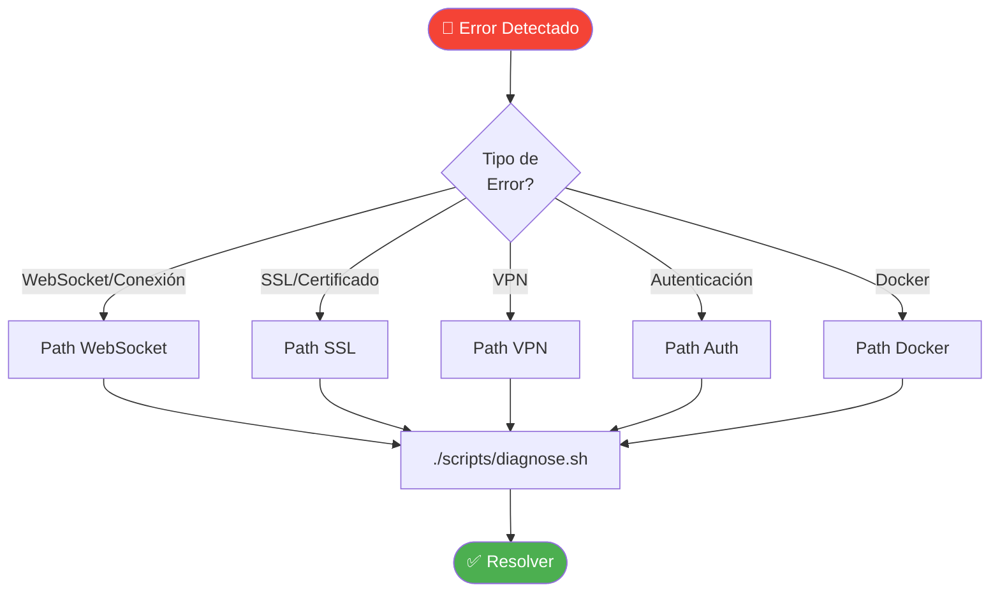

## Árbol de Decisiones - Errores de Conexión

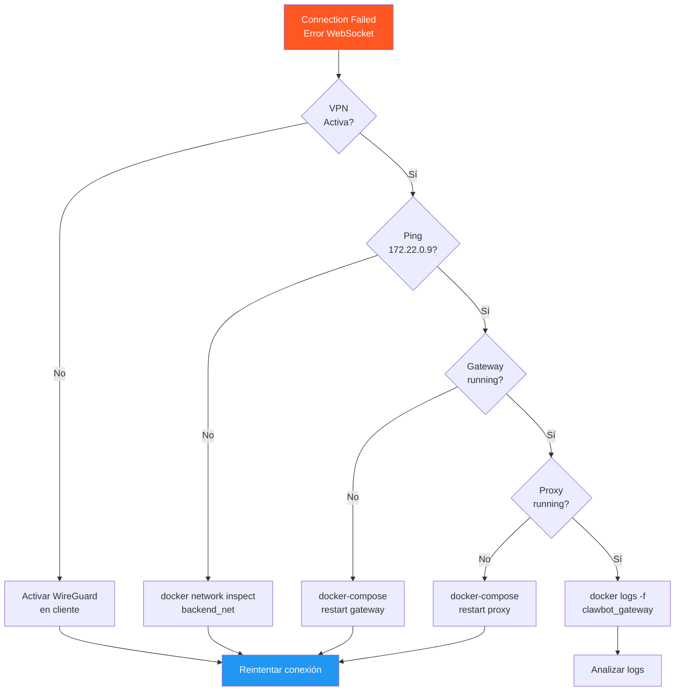

## Diagnóstico de Error 4008/1008 (Emparejamiento)

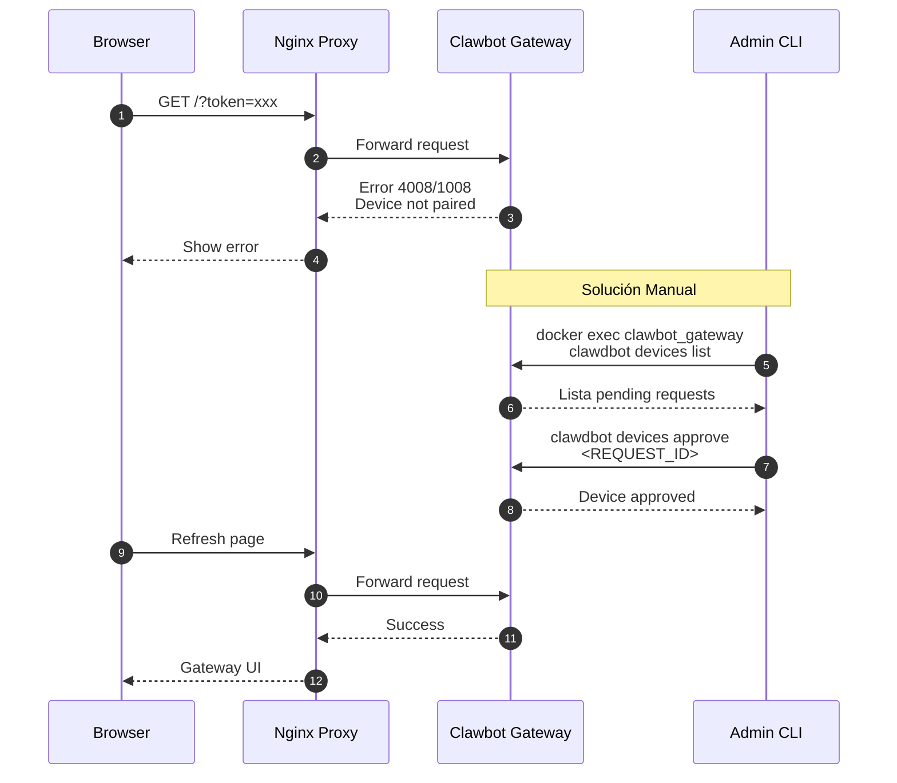

## Análisis de Logs por Servicio

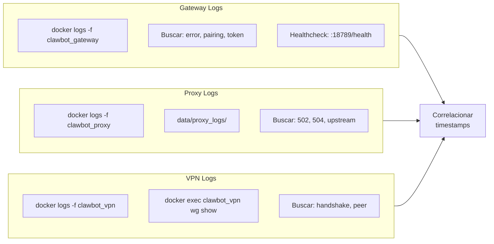

## Errores SSL/Certificados

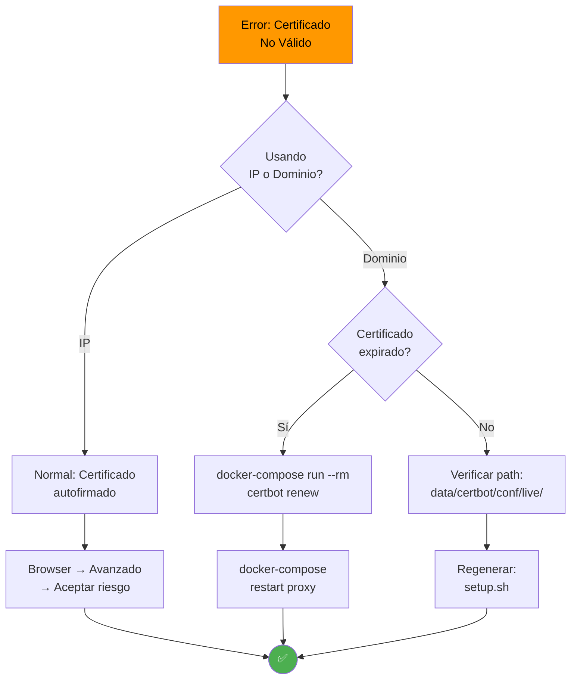

## Script diagnose.sh - Flujo

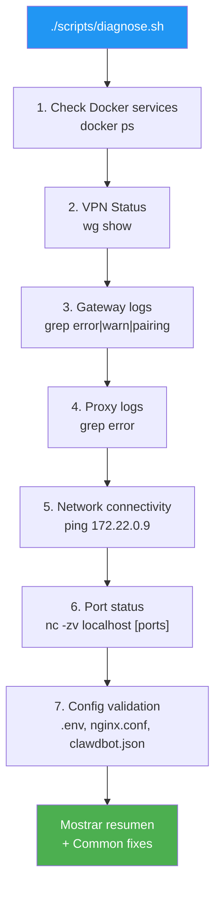

## Matriz de Errores Comunes

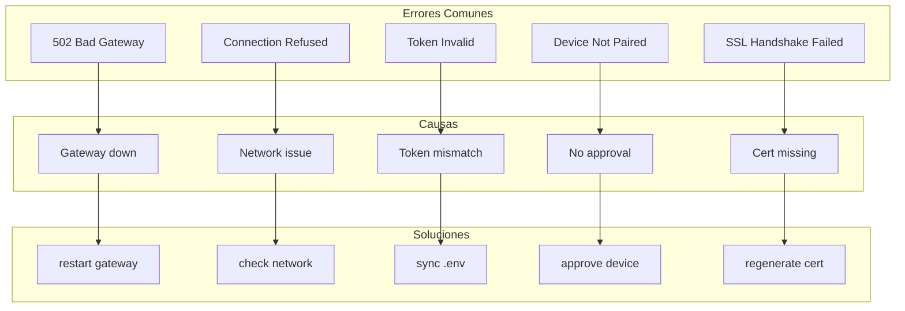

## Verificación de Configuración

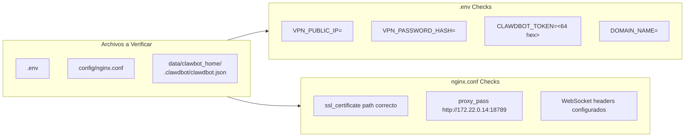

## Comandos de Debug Rápido

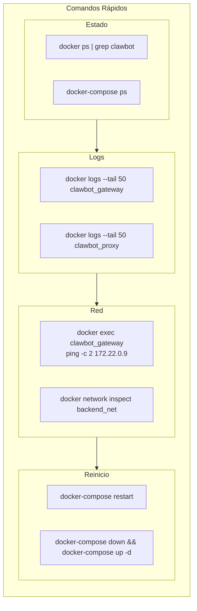

## Debugging Token Issues

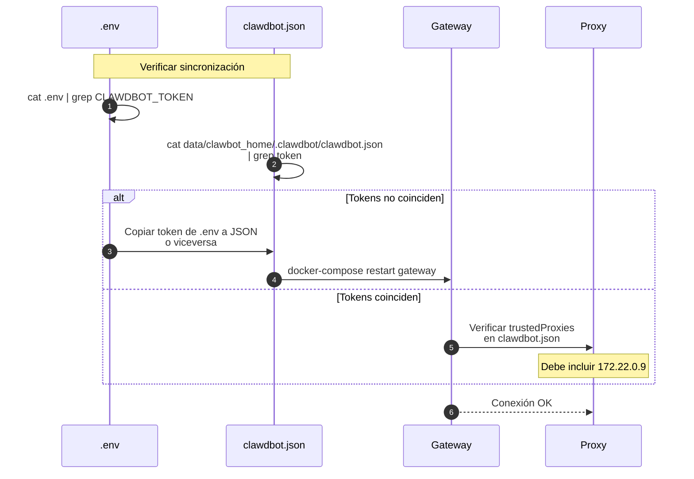

## Checklist de Depuración

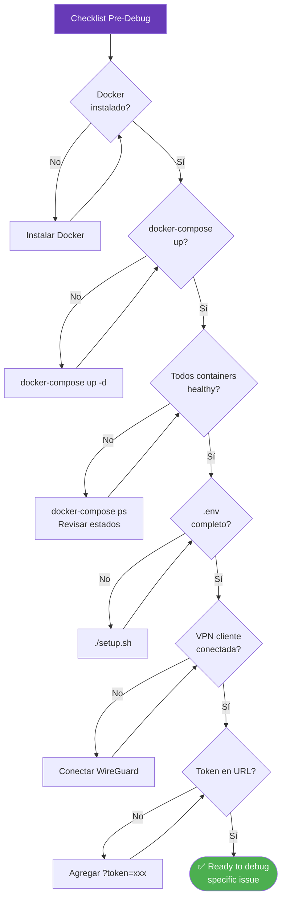

## Auto-Approve Debug

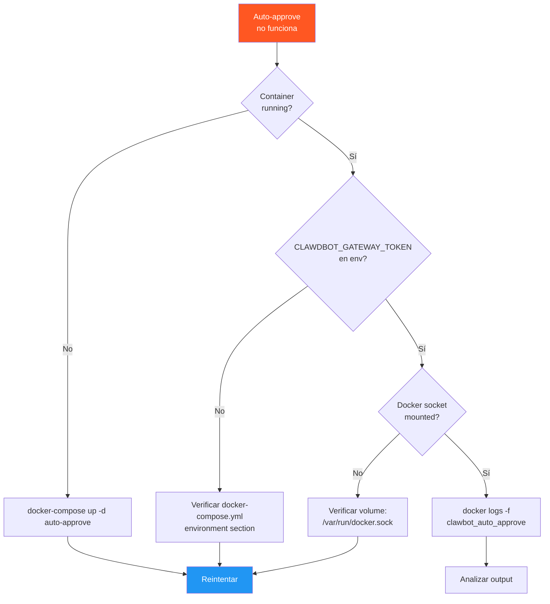
