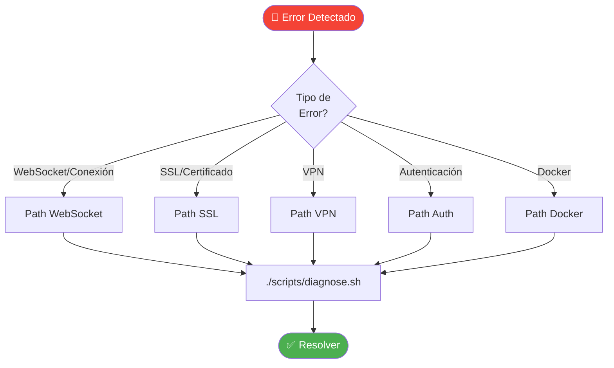
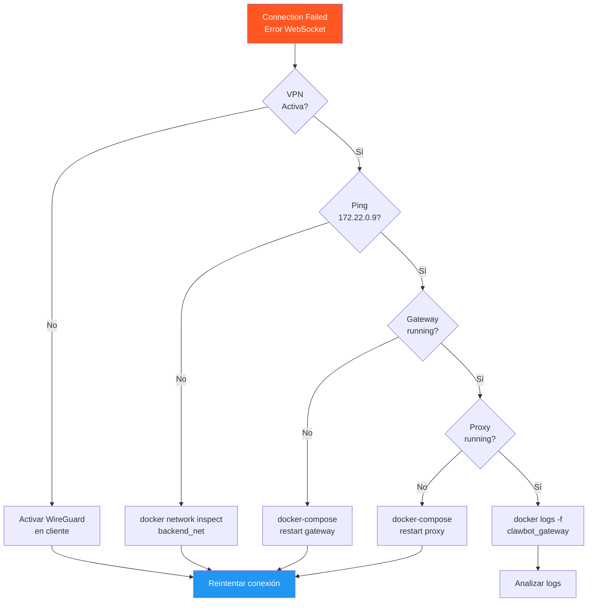
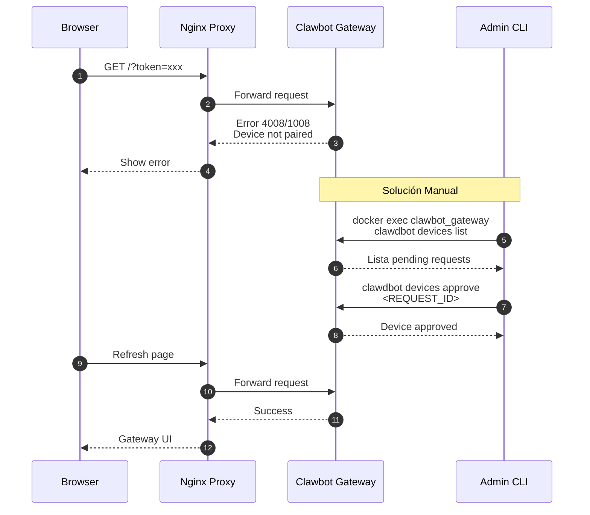

# 🔧 Skill: Experto en Depuración de Aplicaciones

> Documentación oficial: https://docs.openclaw.ai/

## Flujo de Diagnóstico Principal

## Árbol de Decisiones - Errores de Conexión

## Diagnóstico de Error 4008/1008 (Emparejamiento)

