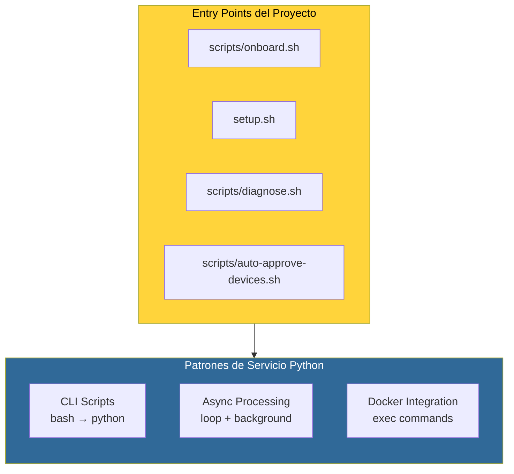
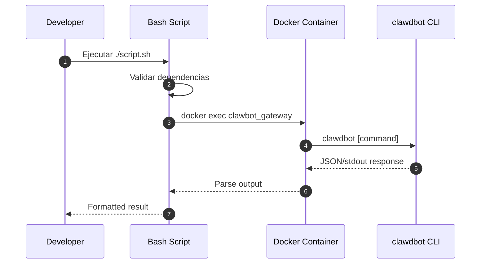
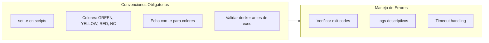
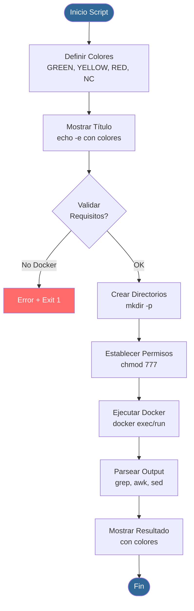
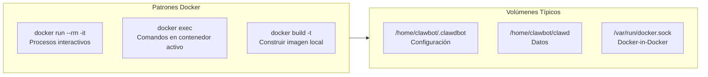
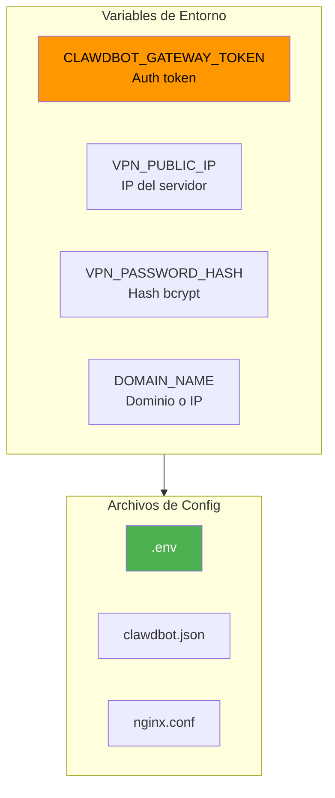
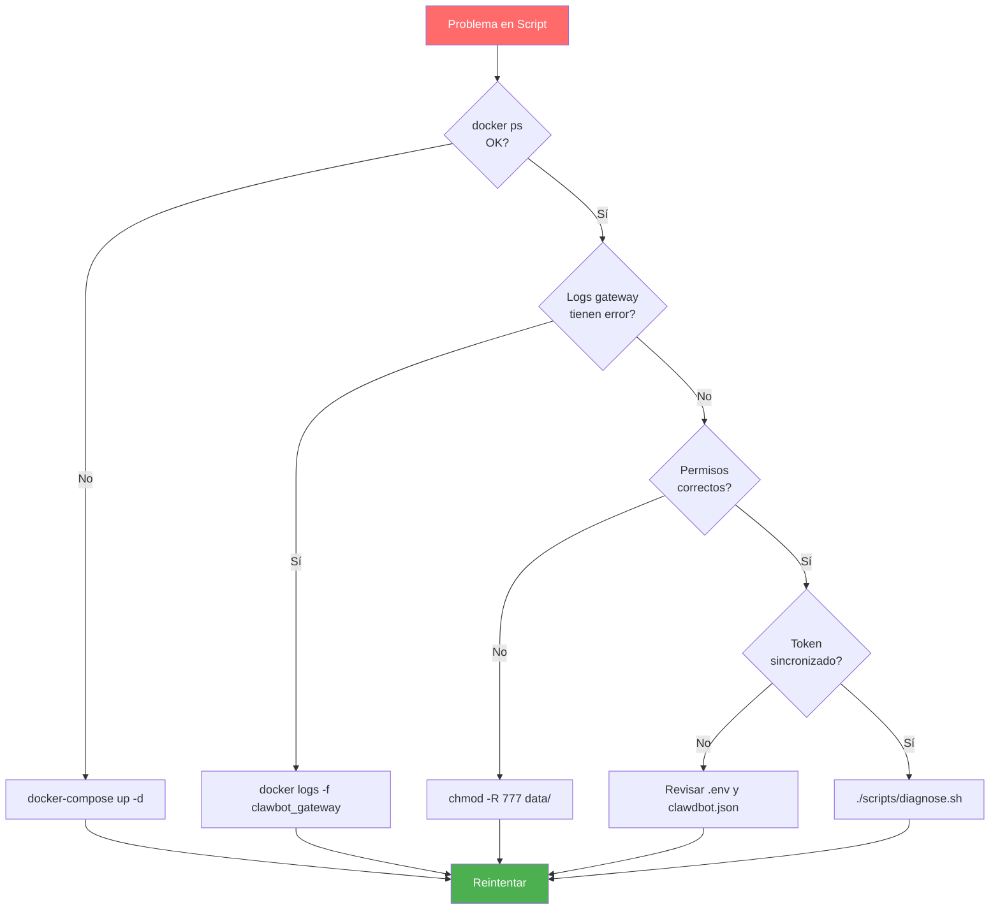

# 🐍 Skill: Experto en Desarrollo de Servicios Python

> Documentación oficial: https://docs.openclaw.ai/

## Arquitectura de Servicios Python en Clawbot



## Flujo de Desarrollo de Scripts



## Convenciones de Código



## Estructura de Script Típico



## Patrones de Integración Docker



## Variables de Entorno Clave



## Ejemplo: Loop de Background

```mermaid
sequenceDiagram
    autonumber
    participant LOOP as While Loop
    participant DOCKER as docker exec
    participant GATEWAY as clawbot_gateway
    participant ACTION as Process Action
    
    loop Cada CHECK_INTERVAL segundos
        LOOP->>DOCKER: Lista dispositivos pendientes
        DOCKER->>GATEWAY: clawdbot devices list
        GATEWAY-->>DOCKER: JSON con pending
        DOCKER-->>LOOP: Parse REQUEST_IDs
        
        alt Hay dispositivos pendientes
            LOOP->>ACTION: Procesar cada REQUEST_ID
            ACTION->>DOCKER: clawdbot devices approve
            DOCKER->>GATEWAY: Aprobar dispositivo
        end
        
        LOOP->>LOOP: sleep $CHECK_INTERVAL
    end
```

## Debugging Tips


